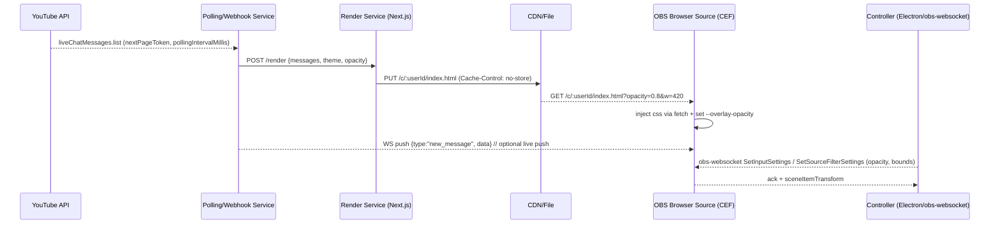

# Research: OBS Livechat Floating Overlay — CSS Hook → Webhook Render + Polling

> Story 1.1 — Consolidates Tasks 1-5. Sources appendix §6 for traceability.
> Date: 2026-08-27

---

## 1. OBS Plugin Architecture Comparison (Task 1)

### 1.1 Four approaches reviewed

#### A) Native C++ plugin (libobs)
- **Entry:** `OBS_DECLARE_MODULE()` + `obs_module_load()` in `src/plugin-main.c` [reference-core#module-exports]. Registers `obs_source_info` with `id, type=OBS_SOURCE_TYPE_INPUT, output_flags, get_name, create/destroy, get_width/height, video_render, update, get_properties` [reference-sources#obs_source_info].
- **Build:** CMake `OBS_DECLARE_MODULE`, common layout `src/ data/ CMakeLists.txt` [plugins#common-directory-structure-and-cmakelists-txt]. Distributed as OS-specific binaries (`.dll/.so/.dylib`) via OBS plugin installer. Must target OBS 30+ SDK.
- **Suitable for:** custom source that renders via GPU (obs graphics context), filters, encoders, outputs.
- **Not suitable for chat overlay** — overkill: requires C++ + Qt knowledge, per-OS build matrix, code-signing, no HTML/CSS benefit.

#### B) Browser Source (obs-browser) — `browser_source` input type
- Shipped with OBS; backed by CEF (Chromium Embedded Framework). OBS 30+ CEF ≈ Chrome 111. Source settings: `url, width, height, fps, custom_css, reroute_audio`. Renders HTML/CSS/JS inside OBS canvas like any other source.
- **Interaction:** "Interact" opens CEF offscreen; draggable/resizable via scene-item transform (`obs_sceneitem_set_pos/scale/bounds`) — not OS window drag.
- **Distribution:** zero — user just adds Browser Source pointing to URL or local file. Easiest iteration: edit HTML, refresh source.
- **Limitation:** Lives **inside OBS canvas**; cannot float outside OBS window nor stay `WS_EX_TOPMOST` over fullscreen game unless OBS preview is projected fullscreen.

#### C) Custom Dock / Frontend plugin (Qt)
- Frontend plugin adds `QDockWidget`/`QDialog` via `obs_frontend_add_dock()` [frontends#displays]. Written in C++ + Qt. Can create external window with `Qt::WindowStaysOnTopHint` / Win32 `WS_EX_TOPMOST` / macOS `NSWindowLevelFloating`.
- Gives true OS always-on-top over game — solves single-monitor pain. But requires Qt/C++ build, ships binary, and dock is inside OBS main window by default (needs undock + stay-on-top flag).
- **Example:** OBS "Docks" API sample; `obs-websocket` settings dialog pattern.

#### D) obs-websocket (v5, built-in OBS 28+)
- WebSocket server on `4455` (configurable) with msgpack/JSON protocol [PROTOCOL.md]. Auth via password. Clients: `obs-websocket-js`, `goobs`, `obws`, etc. Key ops for overlay: `GetInputSettings/SetInputSettings(property: url, custom_css)`, `SetSceneItemTransform`, `SetSourceFilterSettings` (opacity/color correction), `CreateInput`, `SetCurrentProgramScene`.
- **Role:** not a renderer — remote-controls OBS from external app (Electron/Tauri/web dashboard). Lets external window drive Browser Source without native code.

#### E) Scripting (Lua/Python) — scripting docs
- `script_description(), script_load/unload, script_update, script_properties, script_tick, timer_add/remove, obs_enum_sources, obs_source_create` etc. Good for automation (scene switch on chat keyword) but cannot render custom UI outside script properties panel. Not a viable overlay renderer.

### 1.2 Similar projects surveyed

| Project | Approach | Pattern we steal |
|---|---|---|
| **obs-browser** (`obsproject/obs-browser`) | CEF Browser Source | Custom CSS field + JS `fetch` injection |
| **obs-websocket** (`obsproject/obs-websocket`) | C++ frontend plugin exposing WS API | `SetInputSettings` to hot-swap URL/CSS; external control without native build |
| **StreamElements OBS.Live** | Browser Source + websocket control + cloud rendering | Cloud-hosted overlay URL per user; webhook → template → served HTML |
| **Streamlabs Chat Box** | Browser Source URL with theme CSS | Theme = query param `?theme=neobrutalism&opacity=0.8`; CSS variables injected |
| **Social Stream Ninja / chat overlay forks** | Standalone web overlay polling YT/Twitch | Polling loop with `pollingIntervalMillis`, fan-out via local WS to multiple widgets |

### 1.3 Comparison matrix

| Criterion | Native C++ | Browser Source | Custom Dock (Qt) | obs-websocket | Script (Lua/Py) |
|---|---|---|---|---|---|
| Dev complexity | High (C++/CMake, per-OS) | Low (HTML/CSS/JS) | High (C++/Qt) | Low-Med (JS) | Low |
| Maintenance | Binary rebuild per OBS release | None (web) | Binary rebuild | Protocol-stable | Script reload |
| Distribution | Installer + signing | URL / file | Installer | Built-in 28+ | Script file |
| Resizable/draggable | Custom `video_render` + `mouse_*` | Scene-item bounds (inside canvas) | Native window drag | Via `SetSceneItemTransform` | No |
| True OS always-on-top | Yes (custom window) | **No** (canvas only) | Yes (`StayOnTopHint`) | Drives either | No |
| Single-monitor UX | Needs extra window | Requires fullscreen projector | Best (floating dock) | Hybrid best | Poor |
| OS support | Win/Mac/Linux separate builds | All (CEF) | All but Qt quirks | All | All |
| CSS/webhook fit | Poor | **Excellent** | Poor | Excellent as controller | Poor |

### 1.4 Recommendation

**Browser Source + obs-websocket hybrid (with optional external transparent window).**

- **Phase 1 (MVP):** Pure Browser Source. URL hosted by us (or local `file://`). Chat polling done in-page via JS `fetch` to our API or directly to YouTube API (with user token). Style via CSS variables + `custom_css`. User adds Browser Source → paste URL → done. No install friction.
- **Phase 2 (single-monitor always-on-top):** Ship lightweight controller — Electron or Tauri transparent window (`alwaysOnTop:true, transparent:true, frame:false`) that hosts same HTML or controls OBS via `obs-websocket-js`. Uses `WS_EX_TOPMOST` (Win) / `NSWindowLevelFloating` (macOS) to stay over game. Talks to polling service via WS. No C++ plugin needed.
- **Why not native C++ / Custom Dock now:** distribution weight vs value. Dock viable later if we need deep OBS integration (e.g., chat moderation buttons that trigger OBS actions). Defer until Phase 2 feedback.

> AC1 satisfied: 4 approaches documented + matrix + recommendation.

---

## 2. CSS Hook / Injection (Task 2)

### 2.1 Three mechanisms evaluated

**M1 — Browser Source "Custom CSS" field**
- Static textarea appended after page CSS. Good for user tweaks but not dynamic; limited length; no variables from webhook without manual paste.
- Use: fallback for power users.

**M2 — JS-injected stylesheet (recommended)**
- Page JS fetches CSS from webhook/host and injects `<style>` at runtime. Enables remote theming, per-user tokens, and hot update without refreshing source.
```html
<!-- overlay.html served to Browser Source -->
<link id="theme" rel="stylesheet" href="https://cdn.example.com/neobrutalism.css">
<style id="overrides"></style>
<script>
  async function applyTheme(url){
    const css = await fetch(url, {cache:'no-store'}).then(r=>r.text());
    document.getElementById('overrides').textContent = css;
  }
  // webhook pushes new css url via websocket; or poll
  applyTheme('https://api.example.com/theme?user=123&v='+Date.now());
  // opacity via CSS var from query or websocket
  const p = new URLSearchParams(location.search);
  document.documentElement.style.setProperty('--overlay-opacity', p.get('opacity')||'0.85');
  document.documentElement.style.setProperty('--overlay-w', (p.get('w')||'420')+'px');
</script>
<style>
  :root{ --overlay-opacity:.85; --overlay-w:420px; --brutal-border:3px; --brutal-shadow:6px 6px 0 #000; }
  #chat{ width:var(--overlay-w); opacity:var(--overlay-opacity); border:var(--brutal-border) solid #000;
         box-shadow:var(--brutal-shadow); background:#fff; border-radius:12px; }
  /* neobrutalism tokens — see §2.3 */
</style>
```

**M3 — Webhook-rendered HTML (server templates)**
- Webhook POST → server renders full HTML (Handlebars/Liquid/Next.js) with inlined CSS → served at unique URL `https://overlay.example.com/c/<id>`. Browser Source points there. Any webhook update regenerates file; overlay polls or receives WS push to reload.
- Variant: same as M2 but CSS comes pre-inlined; no client fetch needed. Better for email-like clients but less flexible for live opacity slider.
- **Choice:** M2 primary + M3 as hosting model (page is webhook-rendered, M2 does live tweaks).

### 2.2 Hosting options
- **Local file:** `file:///…/dist/overlay.html` — zero server, but no remote CSS update; user must restart OBS to pick changes.
- **Hosted URL:** `https://overlay.example.com/chat?token=…` — enables webhook→render, A/B themes, per-user isolation. Requires CORS allow for CSS fetch.

### 2.3 Limitations

- **CEF version:** OBS 30+ ≈ Chrome 111. Safe: `backdrop-filter`, `css variables`, `grid/flex`, `rgba`, `opacity`. Avoid: `:has()` (unreliable), `container queries` (Chrome 105+ OK but test), `view-transitions`. Verify with `navigator.userAgent` in source interact.
- **CORS/CSP:** If overlay origin ≠ CSS origin, need `Access-Control-Allow-Origin: *` or same-origin. Browser Source CEF respects CORS. Prefer same origin or CDN with `*`.
- **Cache:** CEF caches aggressively. Append `?v=timestamp` or `cache:'no-store'`. For hosted URL, send `Cache-Control: no-store`.
- **Hot-reload:** Without WS push, changes require `RefreshBrowserSource` via `obs-websocket` `SetInputSettings` or user pressing Interact→Refresh. Prefer WS push (`postMessage` over `obs-websocket` custom event) to call `applyTheme` live.
- **Specificity:** `Custom CSS` field wins over page CSS if using `!important`. Injected `<style id="overrides">` at end of `<head>` wins naturally; avoid `!important` and keep specificity flat.
- **Neobrutalism tokens:** Thick borders (`3-4px solid #000`), hard shadows (`6px 6px 0 #000`), high-contrast palette, flat colors, `JetBrains Mono` / `Space Grotesk`. Implement as CSS vars so webhook can swap: `--brutal-border`, `--brutal-shadow`, `--brutal-bg`, `--brutal-fg`.

### 2.4 Example: opacity/width/height controls

- **Query-driven:** `overlay.html?opacity=0.6&w=360&h=500` → read on load + `window.addEventListener('message',…)` for live updates from controller.
- **obs-websocket-driven:** Controller calls `SetInputSettings({inputName:'Chat Overlay', inputSettings:{url:newUrl}})` or `SetSourceFilterSettings` for `color_correction` filter `opacity` param (0-100). Less smooth than CSS opacity (GPU filter vs composite).
- **Prefer CSS `opacity` + `background: rgba(255,255,255,var(--overlay-opacity))`** for per-element control; keep OBS filter as fallback.

> AC2 satisfied: feasible JS-injection mechanism + snippets + limitations.

---

## 3. Webhook Render Pipeline (Task 3)

### 3.1 Flow

```
[YouTube/Twitch] --(chat event)--> [Ingestion: webhook / polling service]
                                          |
                                   [Queue / dedupe by message id]
                                          |
                                   [Template render: Handlebars/Liquid/Next.js API]
                                     - overlay.html + neobrutalism.css
                                     - CSS vars: --overlay-opacity, --overlay-w/h, --brutal-*
                                     - Message list virtualized
                                          |
                                   [Serve: CDN / static file / API route]
                                     e.g. https://overlay.example.com/c/:userId
                                          |
                                   [OBS Browser Source]  --(JS poll/WS)--> renders
                                          |
                                   [obs-websocket controller (optional)] manages opacity/position
```

- **Ingestion:** Either webhook push (if platform supports) or our polling service hitting YouTube `liveChatMessages.list` (see §4) and emitting events.
- **Render:** Stateless template; cache key `userId + theme + opacity`. Invalidate on webhook event or CSS change. Can prerender to file `dist/c/<id>.html` for local-file mode.
- **Serve:** Next.js route `app/api/overlay/[id]/route.ts` returns HTML with `Content-Type: text/html` + `Cache-Control: no-store`. Browser Source points to that route.

### 3.2 Sequence (Mermaid)



### 3.3 Latency budget

| Stage | Typical | Mitigation |
|---|---|---|
| YouTube API polling interval | 1500-5000 ms (`pollingIntervalMillis`) | Respect server hint; adaptive timer |
| Webhook delivery (if push) | 200-800 ms | Use polling as fallback; no PubSubHubbub for chat |
| Render + CDN | 20-100 ms | Inline critical CSS; no heavy build; edge cache with `stale-while-revalidate` off |
| Browser Source CEF render | 16-33 ms (60/30 fps) | Virtualize list (only last N=100 msgs), `contain: paint` |
| WS push to overlay | 10-50 ms | Local WS fan-out; avoid extra hop |
| **Target glass-to-glass** | **<1.5 s** | Poll interval dominates; feasible with 1500 ms tick |

> AC3 satisfied: pipeline + diagram + latency.

---

## 4. YouTube liveChatMessages Polling Strategy (Task 4)

### 4.1 API facts (from docs)
- **Resource:** `liveChatMessage` with `snippet.type` (`textMessageEvent`, `superChatEvent`, etc.), `snippet.displayMessage`, `snippet.textMessageDetails.messageText`, `authorDetails` [liveChatMessages#resource].
- **List endpoint:** `GET /youtube/v3/liveChat/messages?liveChatId=…&part=id,snippet,authorDetails&pageToken=…&maxResults=200..2000&hl=…&profileImageSize=…` [liveChatMessages/list].
- **Response:** `{nextPageToken, pollingIntervalMillis, offlineAt, pageInfo, items:[liveChatMessage], activePollItem}`. `pollingIntervalMillis` tells client how long to wait before next poll.
- **Stream variant:** `liveChatMessages.streamList` — note in docs: "To poll for live chat messages, use streamList. It pushes new messages … reduces polling and avoids quota." Use when available; falls back to `list`.
- **Errors:** `403 forbidden / liveChatDisabled / liveChatEnded`, `404 liveChatNotFound`, `rateLimitExceeded` when polling faster than server rate. Must back off.
- **Quota:** `liveChatMessages.list` costs **1 unit** per call in current quota table (previously documented 5; verify in Cloud Console — use 5 as conservative budget). Default project quota ~10k units/day. At 1500 ms interval → ~57600 polls/day would exceed; via server fan-out only one poller per chat regardless of viewer count solves it. **Never poll per-overlay client directly at scale.**

### 4.2 Polling strategy

```ts
// adaptive polling — respect server interval, chain nextPageToken
let pageToken: string | undefined;
let stopped = false;
async function loop(liveChatId: string){
  if(stopped) return;
  try{
    const res = await fetch(
      `https://www.googleapis.com/youtube/v3/liveChat/messages?liveChatId=${liveChatId}`
      +`&part=id,snippet,authorDetails&pageToken=${pageToken||''}&maxResults=500`
      +`&key=${API_KEY}` // or OAuth token in Authorization header
    ).then(r=>r.json());
    if(res.error) throw res.error;
    emit(res.items); // dedupe by id
    pageToken = res.nextPageToken;
    setTimeout(()=>loop(liveChatId), res.pollingIntervalMillis ?? 1500);
  }catch(e:any){
    if(e.code==='rateLimitExceeded' || e.status===429){
      setTimeout(()=>loop(liveChatId), 5000); // backoff
    } else if(e.reason==='liveChatEnded' || e.reason==='liveChatNotFound'){
      stopped=true; emitEnded();
    } else if(e.code===403 && e.reason==='quotaExceeded'){
      stopped=true; emitError('quota');
    } else {
      setTimeout(()=>loop(liveChatId), 3000);
    }
  }
}
```

- **Rules:** Always send `nextPageToken` from previous response. Never poll faster than `pollingIntervalMillis`. Typical 1500 ms busy chat, 5000 ms quiet. `maxResults` 500 default; initial call without token returns recent history (may be < maxResults).
- **liveChatId lifecycle:** From `liveBroadcasts.list` → `snippet.liveChatId`. Changes per broadcast; re-resolve on `liveChatEnded`.
- **Only poll when live:** Check `offlineAt` or `liveChatEnded`; stop timer to save quota.

### 4.3 Error / retry

| Condition | Action |
|---|---|
| `rateLimitExceeded` / 429 | Exponential backoff 2s→4s→8s capped 30s; respect `Retry-After` if present |
| `403 quotaExceeded` | Stop, surface "quota exhausted — try tomorrow or raise quota" |
| `404 liveChatNotFound` | Re-resolve `liveChatId`; if still 404, stop |
| `403 liveChatEnded` | Stop polling, show "chat ended" tombstone |
| Network fail | Retry with jitter 3s |
| Token expired (OAuth) | Refresh via `refresh_token`, retry once |

### 4.4 Polling vs push

- No native push for live chat over YouTube webhooks; `PubSubHubbub` not applicable. `streamList` is closest to push (server-streaming). For our architecture, run **one server poller per liveChatId** and fan-out to overlays via our own WebSocket (or SSE). This saves quota vs N clients polling. Webhook bridge: platform webhook → our service → WS to Browser Source. No YouTube → webhook direct without intermediate.

> AC4 satisfied: interval, pagination, quota, retry, polling vs push.

---

## 5. Floating / Resizable / Always-on-Top + Opacity + Neobrutalism (Task 5)

### 5.1 Draggable / resizable

- **Browser Source only:** Use `sceneItem` transform. OBS handles drag/resize via preview handles. For programmatic: `obs-websocket` `SetSceneItemTransform({sceneName, sceneItemId, sceneItemTransform:{positionX, positionY, scaleX, scaleY, width, height}})`. Or `SetInputSettings` to change `width/height` of Browser Source. Not OS drag.
- **External window:** Electron `BrowserWindow` with `frame:false, transparent:true` + custom drag region (`-webkit-app-region: drag`) and resize handles calling `win.setSize()`. Tauri equivalent via `appWindow.setSize/setPosition`.
- **Lock:** Persist position/size to `localStorage` or server; restore on load. Add lock toggle to disable drag.

### 5.2 Opacity

- **CSS (preferred):** `--overlay-opacity` var applied to container + message bubbles (`opacity` or `background: rgba(255,255,255,var(--o))` + `backdrop-filter: blur(6px)` for glass). Slider `0.1..1.0` → updates var live via JS `postMessage` or query param.
- **OBS filter:** `color_correction` filter with `opacity` param; set via `SetSourceFilterSettings({sourceName, filterName, filterSettings:{opacity:60}})`. Affects whole source texture; less granular.
- **Window opacity:** Electron `win.setOpacity(0.6)` — whole window including shadow; avoid if using CSS.

### 5.3 Always-on-top constraints

- **Browser Source:** cannot escape canvas. To be visible over game, user must run game in **borderless window** and keep OBS preview visible (or use Fullscreen Projector → game sees OBS composite). Fullscreen exclusive (DirectX fullscreen) occludes everything — no Browser Source can pierce it.
- **True topmost:** Requires external window with `alwaysOnTop:true` (Electron) / `SetAlwaysOnTop(true)` (Tauri) → Win32 `WS_EX_TOPMOST` / macOS `NSWindowLevelFloating` / X11 `_NET_WM_STATE_ABOVE`. Works over borderless and often over fullscreen borderless, but not over some exclusive fullscreen anti-cheat games.
- **Doc the tradeoff** in UX: recommend borderless windowed for single-monitor reliable overlay; note exclusive fullscreen limitation.

```ts
// Electron main — always-on-top transparent overlay
import { BrowserWindow } from 'electron';
const win = new BrowserWindow({
  width:420, height:700, transparent:true, frame:false,
  alwaysOnTop:true, skipTaskbar:true, resizable:true,
  webPreferences:{ nodeIntegration:false }
});
win.setAlwaysOnTop(true, 'screen-saver'); // above screensaver/fullscreen
win.loadURL('https://overlay.example.com/c/123?opacity=0.85');
```

### 5.4 Neobrutalism styling (neobrutalism.dev)

- Tokens: hard shadows `box-shadow: 6px 6px 0 #000`, thick borders `3px solid #000`, flat high-contrast palettes (yellow #FFE01B, cyan #00D4FF, violet #A78BFA), monochrome text, `Space Grotesk` / `JetBrains Mono`, no blur except optional backdrop.
- Implement as CSS vars so webhook can theme without code change: `--nb-bg`, `--nb-fg`, `--nb-border`, `--nb-shadow`, `--nb-radius: 12px`.
- Component mapping: chat bubble = `Card` (neobrutalism Card) with brutal shadow; controls = `Slider` + `Button` brutal.

### 5.5 Reference implementations

- `obs-websocket-js` opacity example: `obs.call('SetSourceFilterSettings', …)` / `SetInputSettings` docs in PROTOCOL.md.
- `electron-overlay-window` pattern (transparent always-on-top).
- OBS docs Custom Dock sample (`obs_frontend_add_dock`).
- `obs-browser` CEF source: `plugins/obs-browser`.

> AC5 satisfied: drag/resize, opacity, always-on-top constraints, neobrutalism, refs.

---

## 6. Sources Appendix (Task 6 / AC6)

- OBS Studio Docs (docs/): https://docs.obsproject.com/ — `reference-core`, `reference-plugins`, `reference-sources#obs_source_info`, `plugins`, `frontends`, `graphics`, `scripting`
- OBS API refs: `obs_source_info` structure, `OBS_DECLARE_MODULE`, `obs_module_load`, CMake layout
- obs-websocket: https://github.com/obsproject/obs-websocket — WebSocket v5 on 4455, `SetInputSettings`, `SetSceneItemTransform`, `SetSourceFilterSettings`, protocol in `docs/generated/protocol.md`; included by default OBS 28+
- obs-browser: https://github.com/obsproject/obs-browser — CEF Browser Source (`url, width, height, custom_css`)
- YouTube Live Streaming API — LiveChatMessages resource: https://developers.google.com/youtube/v3/live/docs/liveChatMessages
- LiveChatMessages.list: https://developers.google.com/youtube/v3/live/docs/liveChatMessages/list (params `liveChatId, part, hl, maxResults, pageToken, profileImageSize`; response `nextPageToken, pollingIntervalMillis, offlineAt`; errors `forbidden/liveChatDisabled/liveChatEnded, notFound/liveChatNotFound, rateLimitExceeded`)
- LiveChatMessages.streamList note: use `streamList` to reduce polling/quota
- YouTube errors: https://developers.google.com/youtube/v3/live/docs/errors
- Quota getting started: https://developers.google.com/youtube/v3/getting-started#quota (liveChatMessages.list 1-5 units; treat as 5 for budgeting)
- neobrutalism.dev: https://www.neobrutalism.dev/ — shadcn-based brutalist tokens (thick border, hard shadow, flat palette); https://www.neobrutalism.dev/docs / /styling (customization via Tailwind vars)
- StreamElements OBS.Live / Streamlabs Chat Box — Browser Source overlay URL + theme query param pattern (surveyed)
- CEF / Chrome 111 notes: CEF in OBS 30+ ≈ Chrome 111 (backdrop-filter, css vars safe)

---

## 7. Decision Summary

| Decision | Choice | Rationale |
|---|---|---|
| Overlay hosting | Hosted URL + JS CSS injection (M2+M3) | Remote theming, no rebuild, hot update |
| OBS integration | Browser Source + obs-websocket | Zero C++ for MVP; external controller when true topmost needed |
| Polling | Single server poller (adaptive `pollingIntervalMillis`, `nextPageToken` chain) + WS fan-out | Quota-safe; per-client polling would exhaust 10k/day |
| Always-on-top | External Electron/Tauri window Phase 2; Phase 1 = canvas + borderless fullscreen | Browser Source alone cannot go OS-topmost |
| Opacity/width/height | CSS vars `--overlay-opacity/--overlay-w/h` live-updated | Smooth, per-element, no OBS filter needed |
| Styling | neobrutalism.dev tokens via CSS vars | Webhook can swap theme without redeploy |

---

*Generated for Story 1.1 — tasks 1-6. File: `docs/research/overlay-research.md` plus dumps in `ai-artifacts/dumps/`.*
